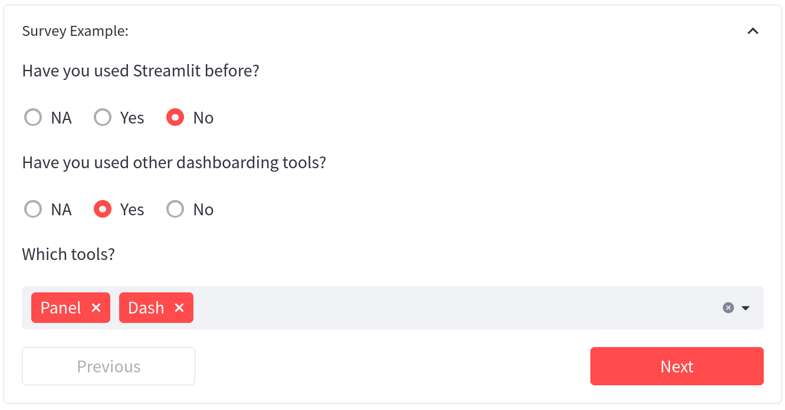
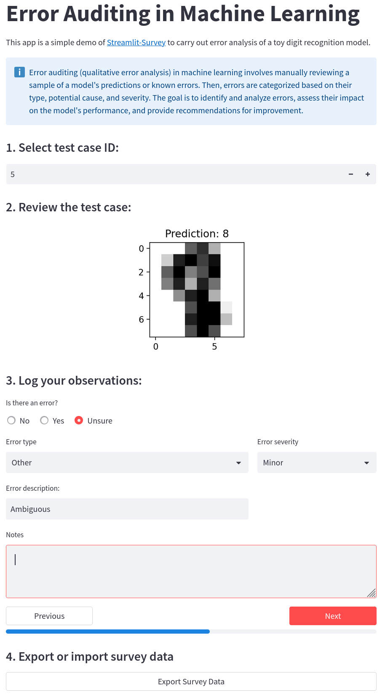
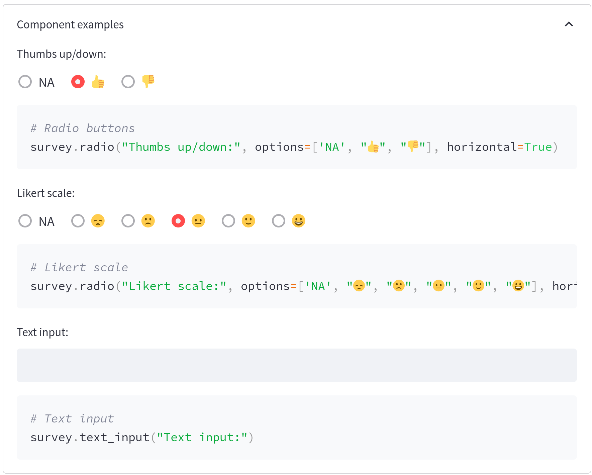

.. image:: https://img.shields.io/badge/Lifecycle-Experimental-339999
   :alt: Lifecycle: experimental
   :target: https://olivierbinette-streamlit-surv-docs-streamlit-survey-docs-hu1jf8.streamlit.app

.. image:: https://img.shields.io/badge/Docs-Streamlit-brightgreen
   :alt: Documentation on Streamlit
   :target: https://olivierbinette-streamlit-surv-docs-streamlit-survey-docs-hu1jf8.streamlit.app

.. image:: https://badge.fury.io/py/streamlit-survey.svg
   :alt: Package on PyPI
   :target: https://pypi.org/project/streamlit-survey/

**Streamlit-Survey**: Survey components for Streamlit apps
==========================================================

**Streamlit-Survey** is a Python package for incorporating surveys and structured feedback into `Streamlit <https://streamlit.io>`_ apps.

It can be used with `Trubrics <https://github.com/trubrics/trubrics-sdk>`_ to collect feedback on datasets, models, and machine learning apps.

Installation
------------

Streamlit-Survey can be installed from PyPI::

        pip install streamlit-survey

Example
-------

Simple paged survey example with a conditional structure and a submit button:

Error auditing toy example for machine learning applications:

Usage
-----

The `streamlit_survey` package contains a `StreamlitSurvey` class that can be used to create and manage survey components::

        import streamlit_survey as ss

        survey = ss.StreamlitSurvey()

Components can be added to the survey using functions similar to Streamlit's input functions:

Features
--------

Survey components are similar to Streamlit inputs, but they have additional features that make them suitable for surveys:

- Questions and responses are automatically saved.
- Component states and previous responses are automatically restored and displayed based on survey data.
- Survey can be saved to and loaded from JSON files.
- Custom survey components can be created for more complex input UI and functionality.
- Customizable paging and option to show a progress bar.

Read the docs:
--------------

`Streamlit-Survey Documentation <https://olivierbinette-streamlit-surv-docs-streamlit-survey-docs-hu1jf8.streamlit.app>`_

License
-------

* Commons Clause + Apache 2.0
